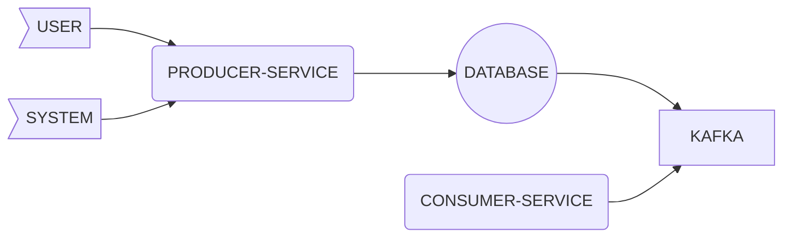

# Spring Boot Debezium Kafka Postgres And OpenApi



## Debezium

````http request
GET localhost:8083/connectors
````

````http request
POST localhost:8083/connectors
{
  "name": "dgm",
  "config": {
    "connector.class": "io.debezium.connector.postgresql.PostgresConnector",
    "tasks.max": 1,
    "database.history.kafka.bootsatrap.servers": "kafka:9092",
    "database.history.kafka.topic": "schema-changes.movies",
    "database.hostname": "db",
    "database.port": "5432",
    "database.user": "postgres",
    "database.password": "1234567890",
    "database.dbname": "dgm",
    "database.server.name": "db",
    "tombstones.on.delete": "false",
    "topic.prefix": "product",
    "table.include.list": "public.product",
    "heartbeat.interval.ms": "5000",
    "key.converter": "org.apache.kafka.connect.json.JsonConverter",
    "key.converter.schemas.enable": "false",
    "value.converter": "org.apache.kafka.connect.json.JsonConverter",
    "value.converter.schemas.enable": "false",
    "plugin.name": "pgoutput",
    "decimal.handling.mode": "double"
  }  
}

````

````http request
DELETE localhost:8083/connectors/dgm
````

To add before data in kafka message you need to execute

````sql
alter table product replica identity full;
````